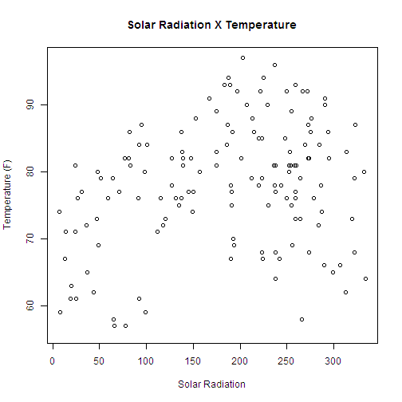
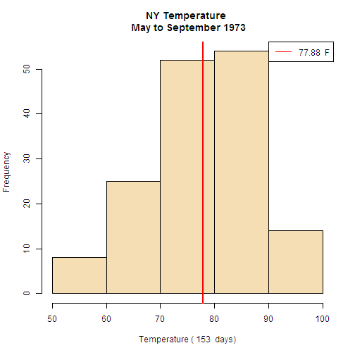

Air Quality New York 1973
========================================================
author: emaciel
date: September 19th 2014

<small>
Coursera Developing Data Products
September 2014
</small>

<big>Do you see a correlation between variables? 

Do we need more?</big>

Dataset Description
========================================================

Dataset: airquality dataset (May to September 1973 - New York)

Variables in the dataset:

```
[1] "Ozone"   "Solar.R" "Wind"    "Temp"    "Month"   "Day"    
```
Selected:
- <strong>Solar.R (lang) - Solar Radiation</strong>
- <strong>Temp (degrees F) - Temperature</strong>

- <strong>STUDY: </strong>Is there a correlation between <strong>Temperature</strong> and <strong>Solar Radiation</strong> ? Or do we need more data?


Dataset summary results
========================================================

<strong>Temperature</strong>

Mean

```
[1] 77.88
```
Standard Deviation

```
[1] 9.465
```
Lowest / Highest reading

```
[1] 56
```

```
[1] 97
```
***

<strong>Solar Radiation</strong>

Mean

```
[1] 185.9
```
Standard Deviation

```
[1] 90.06
```
Lowest / Highest reading

```
[1] 7
```

```
[1] 334
```


Air Quality Plots
========================================================

 

***

 


Conclusion
========================================================

- Considering the plot Temperature X Solar Radiation, it does not look like that there is a strong relation between the two variables.
- i.e., high temperature equals high solar radation
- There are more factors to consider, and more inputs will need to be analyzed
- Ozone levels, cloud coverage, etc. to make a stronger case on asserting about the correlation between Temperature and Solar Radiation
- Expand the study to more data (more readings)
